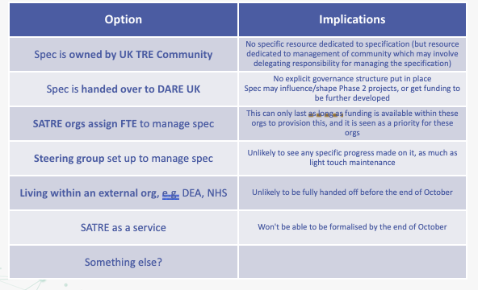

# Governance

**When?**
12 Sept 2023, 15:00 - 16:00 Europe/London ([see in your time zone](https://arewemeetingyet.com/London/2023-09-12/15:00))

**What?**
_[SATRE (Standardised Architecture for Trusted Research Environments)](https://medium.com/satre) is a DARE UK Driver Project working to standardise access to secure data in trusted research environments. It includes University of Dundee, Alan Turing Institute, UCL, Ulster University, Research Data Scotland._.
[Collaboration Cafes](https://the-turing-way.netlify.app/community-handbook/coworking/coworking-collabcafe.html) are **online collaboration and coworking calls** for anyone interested in learning about, discussing and contributing to the project.

**Who?**
_Anyone_ interested in our project & the TRE space is welcome to join this call. No prior sign-ups needed!

**_All questions, comments, and recommendations are welcome!_**

---

## Check-in and icebreaker

9 attendees added their names

## How to contribute to the project

Please read a walkthrough of the project and how to contribute: [Walkthrough Doc on GitHub](https://github.com/sa-tre/satre-specification/blob/main/docs/Walkthrough.md) or [Google Doc Version](https://docs.google.com/document/d/1zAWxubPWxukDN8WKIXe89uhJitSaicp5/edit?usp=sharing&ouid=105089893876648516018&rtpof=true&sd=true)

## Today's theme: Governance

**Governance of the SATRE specification**

## Breakout rooms: Topic proposals and notes

_While no sign-ups are required to attend Collaboration Cafe, if you have an idea for a topic you'd like to discuss in a breakout room, please add it below and put your name next to it. A good place to start to find discussion topics are on the [SATRE Specification GitHub Repository Issue Board](https://github.com/sa-tre/satre-specification/issues)._

- Main room: General help with getting involved with SATRE and Collab Cafe
- Breakouts:
  - **Today's Theme:** Governance of the SATRE specification

### Breakout room 1

- What do we want the spec to look like in 3, 6, 12, 18 months?
  - This really depends on who is on the receiving end of any handover - or conversely, the answer to this becomes clearer only with more development
  - With more people doing evaluations, this will influence how it looks, especially if they contribute back suggestions
- Which of these models feels right, if any?
- Which would you actively get involved with?
- What resources/infra would we need to deliver one of these models? Where can we source them?

#### Notes

- Can we link the spec to people coming up with other accreditations, especially for the NHS sub-national SDEs
- Seems like DARE should have it within their remit to support it further
  - can they integrate it into any future projects
- Can users (e.g. builders, evaluators) contribute back if they spot things that they think should be added/changed?
- UK stats authority document may have a lot of overlap with SATRE?
  - https://uksa.statisticsauthority.gov.uk/digitaleconomyact-research-statistics/better-access-to-data-for-research-information-for-processors/
- Should we encourage people to fork SATRE repo for their own purposes?
  - not the goal of what it's there for currently
- Probably best option we think is DARE
  - But definitely need to retain TRE community and builder input
- Can we get more funds to just do a phase 2 of SATRE?
  - Doesn't need to be the exact same people
  - Objective could be to make it into shape such that it's attractive for others to take on long term (or becomes self-sustaining via the community)

### Breakout room 2

- What do we want the spec to look like in 3, 6, 12, 18 months?
- Which of these models feels right, if any?
- Which would you actively get involved with?
- What resources/infra would we need to deliver one of these models? Where can we source them?

#### Notes

- What was the original purpose of the SATRE project? What would DARE like to happen?
  - DARE would like to see it progress into phase 2, spec will exist in phase 2
    - Ideally it should exist as an independent group. Try to keep as community-owned + DARE support, rather than DARE owned
    - [TRE working group at Research Data Alliance](https://www.rd-alliance.org/2nd-bof-trusted-secure-research-environments-sensitive-confidential-data-fairness-closed-data-and) (Salzburg conference) may be a vehicle, although increases number of moving parts
      - feeling that UK is ahead and has a lot to contribute
    - evolve into embracing idea of Tiering - profiles for different "tiers" of TRE. might be a good roadmap for future of development of spec
- Audit of the spec? Why would anybody keep up with more complex aspects of the spec if there's no "badge" to earn?
  - Get to position where following SATRE helps meet other accreditations easier e.g. alignment with DEA v2
- Data Access Policy come down from NHS, held in SDEs first, difficult to do anything outside - if standard could help demonstrate compliance?
  - Further evolution of standard - getting more people on-board and buying into it, reducing overall bureaucracy, developing more about federation and co-operation
- Three dimensions/streams for evolution:
  1. Federation: federating TREs needs increased standardisation and improved degrees of trust; SATRE-style TREs should make these things easier.
  2. Accreditation: similarly, being SATRE-compliant should make it easier to pass accreditation (like having ISO27000 makes DEA easier)
  3. Tiering: capturing the ideas that we don't always need bomb-proof shelters for lower-risk data.
- Owned by community or an organisation like DARE UK
  - community-generated spec for benefit of community
  - connecting top-down ("powers that be", law/policy makers?) and bottom-up (people actually making/delivering)
  - DARE have influence with UK stats authority, DEA process, vehicle for influence
- Make it useful! If it's useful it'll gain traction, if not then perhaps it shouldn't!
- Maybe some sensitivity about some elements from some quarters

### Wrap up

- Evaluations
- Final few Collab Cafes
- UK TRE community

## Agenda

| Time    | Activity                                    |
| ------- | ------------------------------------------- |
| 10 mins | Introductions and breakout room suggestions |
| 20 mins | (1st breakout session)                      |
| 5 mins  | (☕️ Break)                                  |
| 20 mins | (2nd breakout session)                      |
| 5 mins  | :wave: Reflections and close                |
